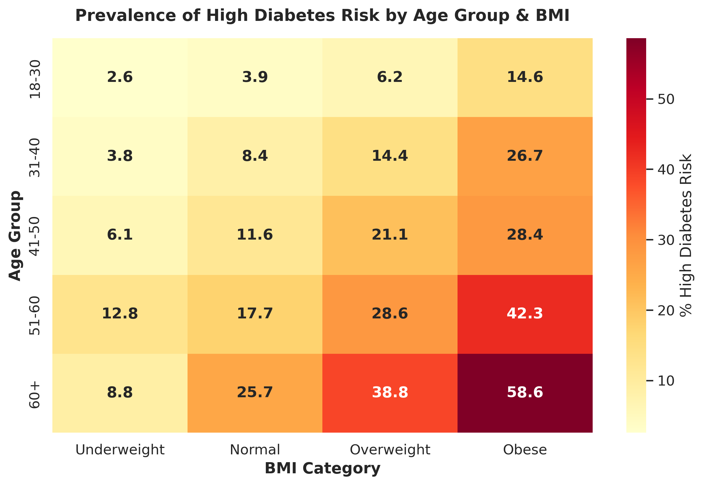
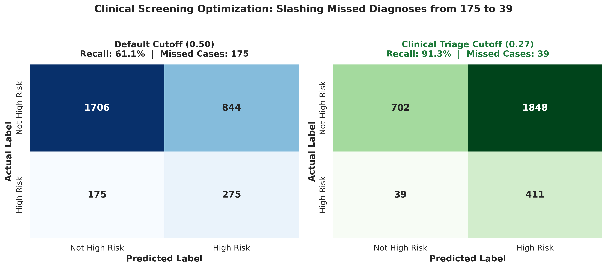
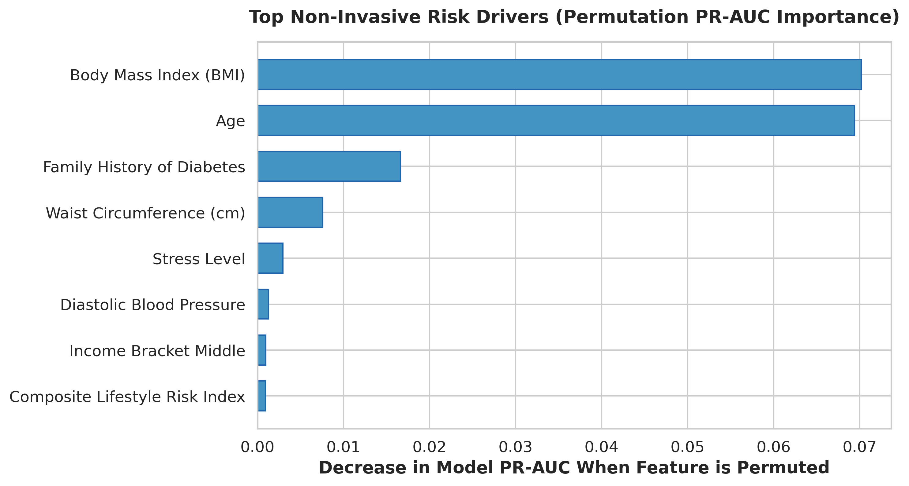
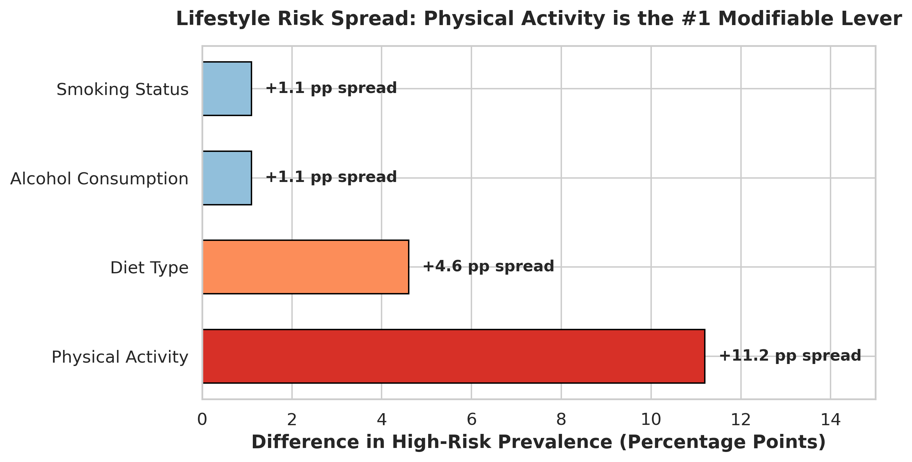

# Diabetes Risk Analysis & Clinical Screening Prioritization

An end-to-end data science project utilizing machine learning to predict diabetes risk and optimize clinical screening resource allocation.

---

## 1. Executive Summary & Motivation

Diabetes screening typically relies on invasive and costly laboratory blood tests (`fasting_blood_sugar`, `hba1c_level`). Community clinics operating under constrained budgets and medical staffing cannot test every visiting patient.

> **Personal Motivation:**  
> Coming from a family with a history of diabetes, this project was deeply personal. I set out to understand what truly drives diabetes risk before lab tests are ever drawn, and how data-driven triage can help community clinics prioritize testing where it matters most.

This project delivers a **non-invasive pre-screening triage model** trained exclusively on demographic, physical, and modifiable lifestyle factors. By optimizing the decision threshold for clinical utility, our model catches **91.3% of all high-risk patients** (slashing missed cases from 175 down to 39 on the holdout test set), providing a dependable triage system to guide laboratory blood test referrals.

---

## 2. Business Understanding & Stakeholder Questions

### Key Stakeholders:
* **Clinic Screening Team:** Decides which patients to prioritize for follow-up laboratory testing.
* **Health Education Team:** Decides which modifiable lifestyle habits to target in preventive health campaigns.

### Answers to Core Business Questions:

| Question Type | Business Question | Data-Backed Finding |
|---|---|---|
| **1. Descriptive** | What share of patients in each age group and BMI category has high diabetes risk? | Risk escalates steeply with age and adiposity. High-risk prevalence reaches **32.8% in patients aged 60+** (vs. 4.3% in ages 18–30) and **34.8% in the Obese category** (vs. 5.9% in Underweight). |
| **2. Predictive** | Which patients are most likely to be high risk for screening prioritization? | Our tuned Gradient Boosted Decision Tree triage model achieves **91.3% Recall** on holdout patients, accurately flagging high-risk individuals before invasive tests are ordered. |
| **3. Prescriptive** | Which modifiable lifestyle factors show the largest risk difference? | **Physical activity** is by far the strongest modifiable factor with an **11.2 percentage-point risk spread** (Sedentary: 21.0% vs Active: 9.8%). In comparison, smoking (1.1 pp) and alcohol consumption (1.3 pp) exhibited minor variations. |

<p align="center">
  
</p>

---

## 3. Project Pipeline & Architecture

Following the industry-standard **CRISP-DM** methodology, this repository is organized into distinct, modular phases:

```
diabetes-risk-analysis/
├── data/
│   ├── diabetes_risk.csv              # Raw dataset (15,000 rows, 19 columns)
│   ├── diabetes_risk_cleaned.csv      # Cleaned dataset (missing values handled)
│   └── processed/                     # Train/test split matrices (scaled & unscaled)
├── models/
│   └── diabetes_risk_screener.joblib  # Production-ready trained triage model
├── notebooks/
│   ├── 02_data_cleaning.ipynb         # Data audit, validation, & missing value imputation
│   ├── 03_data_understanding.ipynb    # Data types, dimensions, distributions
│   ├── 04_eda.ipynb                   # Demographic, clinical, & lifestyle exploratory analysis
│   ├── 05_feature_engineering.ipynb   # Domain metrics, leakage control, encoding, & split
│   └── 06_modeling.ipynb              # Model tournament, threshold tuning, & evaluation
├── reports/
│   └── figures/                       # High-resolution (300 DPI) publication-ready plots
│       ├── 01_confusion_matrix_comparison.png
│       ├── 02_age_bmi_risk_heatmap.png
│       ├── 03_top_feature_importances.png
│       └── 04_lifestyle_factors_impact.png
├── requirements.txt                   # Environment reproduction dependencies
└── README.md                          # Project documentation
```

---

## 4. Machine Learning & Clinical Evaluation

### Preventing Data Leakage
`fasting_blood_sugar` and `hba1c_level` are clinical diagnostic criteria for diabetes. Including them creates circular logic where models simply relearn lab thresholds rather than identifying candidates for screening. These markers were intentionally quarantined to build a true pre-screening model.

### Model Tournament Leaderboard (Holdout Test Set)

Models were evaluated using **Recall (Sensitivity)**, **PR-AUC**, and **F2-Score** to penalize false negatives (missed high-risk patients):

| Model | Classification Threshold | Recall (High Risk) | Precision | F2-Score | PR-AUC | ROC-AUC |
|---|---|---|---|---|---|---|
| **Logistic Regression** (Balanced) | 0.50 | 63.6% | 25.2% | 0.487 | 0.321 | 0.710 |
| **Random Forest** (Balanced) | 0.50 | 43.8% | 27.4% | 0.391 | 0.304 | 0.698 |
| **HistGradientBoosting** (Default) | 0.50 | 61.1% | 24.6% | 0.471 | 0.309 | 0.698 |
| **HistGradientBoosting (Tuned Triage)** | **0.27** | **91.3%** | **21.7%** | **0.552** | **0.309** | **0.698** |

### Clinical Impact of Threshold Tuning
In public health screening, a **False Negative** (leaving a high-risk diabetic patient undiagnosed) is clinically dangerous, whereas a **False Positive** (administering a routine blood test) carries negligible medical risk.

* **At Default Cutoff (0.50):** The model missed **175** high-risk patients (Recall: 61.1%).
* **At Clinical Triage Cutoff (0.27):** Missed patients dropped from 175 to **39**, successfully capturing **411 out of 450 (91.3%)** high-risk individuals in the holdout test set.

<p align="center">
  
</p>

---

## 5. Top Risk Drivers (Permutation Feature Importance)

Permutation importance identified the key non-invasive factors driving predictions:
1. **BMI** (Body Mass Index) — Primary non-invasive predictor of metabolic risk
2. **Age** — Progressive risk accumulation
3. **Family History of Diabetes** — Strong genetic predisposition factor
4. **Waist Circumference (cm)** — Central adiposity and visceral fat marker
5. **Physical Activity Level** — Dominant modifiable behavioral lever

<p align="center">
  
</p>

---

## 6. Actionable Stakeholder Recommendations

<p align="center">
  
</p>

### For the Clinic Screening Team:
1. **Implement Algorithmic Triage:** Prioritize patients with a model risk score $\ge 0.27$ for fasting plasma glucose / HbA1c blood tests. This guarantees catching $>90\%$ of high-risk cases while preventing random testing.
2. **Fast-Track Senior & Obese Patients:** Automatically schedule diagnostic tests for any patient aged 60+ with $\text{BMI} \ge 30$, as over 1 in 3 in this cohort is high-risk.

### For the Health Education Team:
1. **Focus on Physical Activity First:** Interventions addressing sedentary behavior will yield the largest risk reduction ($11.2\text{ pp}$ improvement vs $1\text{ pp}$ for smoking cessation alone).
2. **Combine Movement with Waist Reduction:** Promote walking and resistance training programs specifically tailored for patients with waist circumference $\ge 90\text{ cm}$.

---

## 7. How to Reproduce

1. **Clone the repository:**
   ```bash
   git clone https://github.com/bengit/diabetes-risk-analysis.git
   cd diabetes-risk-analysis
   ```

2. **Install dependencies:**
   ```bash
   pip install -r requirements.txt
   ```

3. **Execute the pipeline notebooks in order:**
   - `02_data_cleaning.ipynb`
   - `03_data_understanding.ipynb`
   - `04_eda.ipynb`
   - `05_feature_engineering.ipynb`
   - `06_modeling.ipynb`